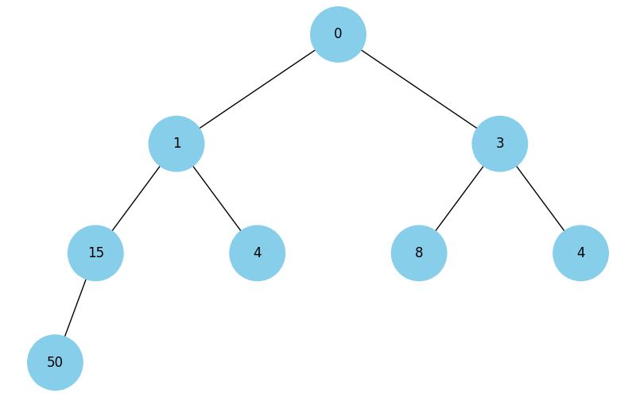

# Програма для візуалізації мін-купи

Ця програма дозволяє додавати числа в мін-купу, виводити її структуру та візуалізувати дерево купи. Мін-купа — це структура даних, в якій кожен батьківський елемент не перевищує своїх нащадків.

## Особливості:

- Додає елементи в мін-купу.
- Виводить структуру мін-купи після кожного додавання.
- Візуалізує структуру купи у вигляді дерева.
- Користувач може вводити числа через пробіл, або завершити введення командою `q`.

## Інструкція з використання

1. Клонувати репозиторій:

```
git clone https://github.com/yourusername/min-heap-visualization.git
```

2. Встановити залежності:

```
pip install -r requirements.txt
```

3. Запустити програму:

```
python main.py
```

4. Програма попросить вас ввести числа для додавання в купу через пробіл. Наприклад:
   1 15 4 0 4 8 3 50

5. Програма продовжить працювати, поки не буде введена команда `q` для завершення.

## Приклад використання

Вітаємо у програмі для візуалізації мін-купи!
Введіть числа для додавання в купу через пробіл. Для завершення введіть 'q'.
Введіть числа (через пробіл) або 'q' для виходу: 1 15 4 0 4 8 3 50
Число 1 додано в купу.
Число 15 додано в купу.
Число 4 додано в купу.
Число 0 додано в купу.
Число 4 додано в купу.
Число 8 додано в купу.
Число 3 додано в купу.
Число 50 додано в купу.
Введіть числа (через пробіл) або 'q' для виходу: q
Вихід з програми...

В окремому вікні відкриється візуалізація 

## Технології

- Python 3.x
- `matplotlib` для візуалізації
- `networkx` для побудови графів

## Важливі файли:

## Важливі файли:

- `main.py`: Головний файл програми, який виконує логіку мін-купи та виведення.
- `heap.py`: Містить реалізацію мін-купи та класів для роботи з деревом.
- `visualization.py`: Містить функції для візуалізації дерева мін-купи.
- `Figure_1.png`: Зображення, що відображає структуру мін-купи.
