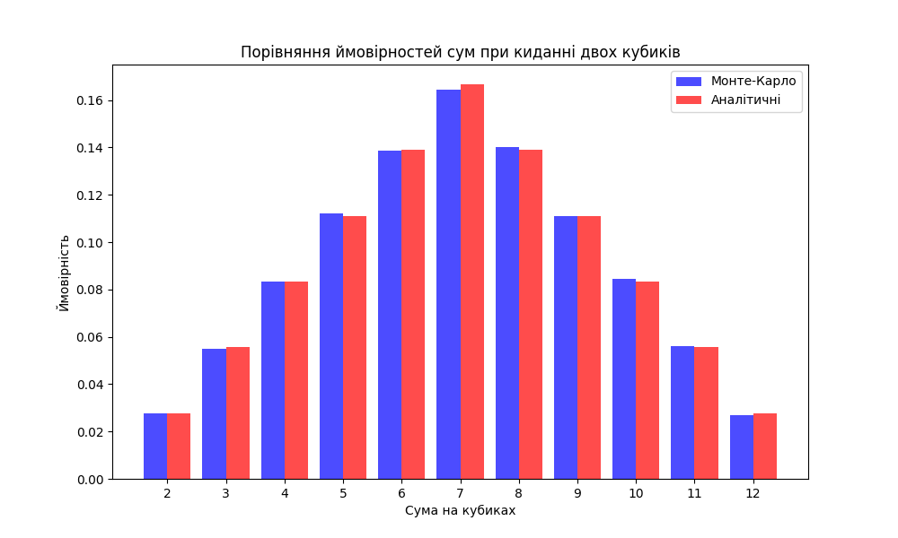

# Завдання 7: Використання методу Монте-Карло для симуляції кидання двох кубиків

## Опис

Цей проєкт реалізує симуляцію кидання двох кубиків за допомогою методу Монте-Карло. Програма моделює велику кількість кидків кубиків, підраховує суми чисел, які випали на кубиках, і визначає ймовірність кожної можливої суми від 2 до 12.

## Алгоритм

1. **Моделювання кидків кубиків**: Використовуємо функцію `roll_dice()`, яка генерує випадкові значення для двох кубиків і обчислює суму кожного кидка.
2. **Підрахунок ймовірностей**: Після кожного кидка програма підраховує, скільки разів випала кожна сума.
3. **Генерація графіка**: Програма будує графік, що порівнює ймовірності, отримані за допомогою методу Монте-Карло, з аналітичними ймовірностями.
4. **Виведення таблиці**: Виводиться таблиця з ймовірностями для кожної суми (від 2 до 12), порівнюючи результати методом Монте-Карло і аналітичні значення.

## Виконання

1. Програма виконується на Python 3.
2. Для виконання необхідно мати бібліотеки: `numpy` та `matplotlib`.

### Інсталяція бібліотек:

```bash
pip install numpy matplotlib
```

### Для запуску програми:

```bash

python main.py
```

### Виведення

Програма виводить таблицю ймовірностей сум на кубиках, порівнюючи отримані значення методом Монте-Карло з аналітичними розрахунками, а також генерує графік для наочності.

### Приклад виведення:

## Сума | Метод Монте-Карло | Аналітична

2 | 2.78% (2782 разів на 100000 кидків) | 2.78% (2777 разів на 100000 кидків)
3 | 5.49% (5491 разів на 100000 кидків) | 5.56% (5555 разів на 100000 кидків)
4 | 8.33% (8330 разів на 100000 кидків) | 8.33% (8333 разів на 100000 кидків)
5 | 11.23% (11230 разів на 100000 кидків) | 11.11% (11111 разів на 100000 кидків)
6 | 13.87% (13873 разів на 100000 кидків) | 13.89% (13888 разів на 100000 кидків)
7 | 16.45% (16452 разів на 100000 кидків) | 16.67% (16666 разів на 100000 кидків)
8 | 14.00% (14002 разів на 100000 кидків) | 13.89% (13888 разів на 100000 кидків)
9 | 11.10% (11103 разів на 100000 кидків) | 11.11% (11111 разів на 100000 кидків)
10 | 8.45% (8453 разів на 100000 кидків) | 8.33% (8333 разів на 100000 кидків)
11 | 5.61% (5608 разів на 100000 кидків) | 5.56% (5555 разів на 100000 кидків)
12 | 2.67% (2675 разів на 100000 кидків) | 2.78% (2777 разів на 100000 кидків)

## Графік порівняння ймовірностей

Графік відображає ймовірності для кожної суми на кубиках за методом Монте-Карло в порівнянні з аналітичними ймовірностями.

В окремому вікні відкриється візуалізація 
